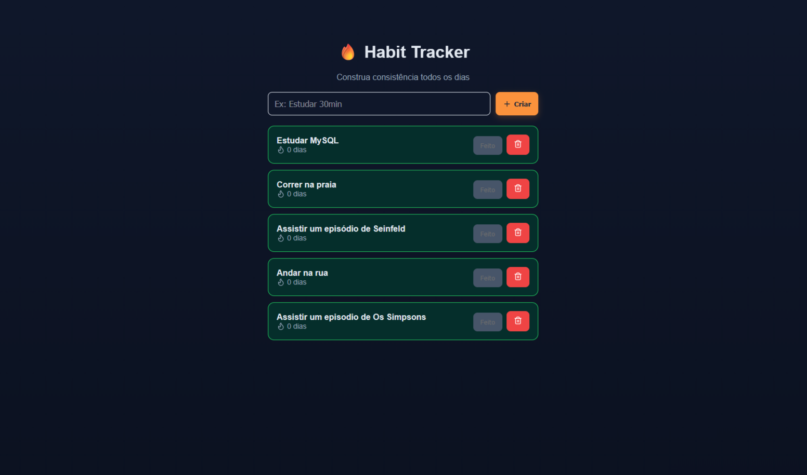

# 🎨 Streak Zero — Frontend

Interface do usuário da aplicação **Streak Zero**, um habit tracker com sistema de streak diário.

---

## 🌐 Demo

👉 https://streak-zero.vercel.app

---

## 🧠 Funcionalidades

* 📋 Listar hábitos
* ➕ Criar novos hábitos
* 🔥 Visualizar streak atual
* ✅ Marcar hábito como concluído
* 🚫 Bloqueio de múltiplas conclusões no mesmo dia
* ⚡ Atualização em tempo real via API

---

## 🧱 Tecnologias

* React
* CSS (custom)
* Fetch API

---

## 🔗 Integração com API

A aplicação consome a API hospedada no backend:

```id="p91xka"
https://streak-zero-backend.onrender.com/
```

---

## 📁 Estrutura

```id="t1zv5o"
src/
  components/
  config/
  App.jsx
```

---

## ⚙️ Rodando localmente

```id="u7p3lm"
npm install
npm run dev
```

---

## ⚠️ Configuração

Defina a URL da API em:

```id="k2q9zd"
src/config/api.js
```

---

## 📸 Screenshots



---

## 🚀 Deploy

* Vercel

---

## 👨‍💻 Autor

Desenvolvido por Sandoval Melo

---
